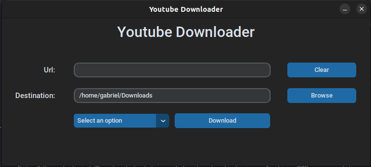
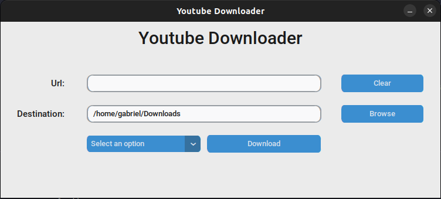

# pytube-youtube-downloader

This program downloads videos and audios from YouTube, it uses Pytube to get the media and to create the graphical interface it uses Custom Tkinter. To use the app you need to run the executable in YoutubeDownloader/YoutubeDownloader or you can install the dependencies in requirements.txt and run the main.py file

  ##
 Here's what the interface looks like:

 

<ul>
  <li>
    <a href="https://www.mediafire.com/file/n5z514gbqzf2fju/YoutubeDownloader/file">Download for Linux</a>
  </li>

  <li>
    <a href="https://www.mediafire.com/file/synre8fcdcvkkmv/YoutubeDownloader.rar/file">Download for Windows</a>
  </li>

</ul>
    

